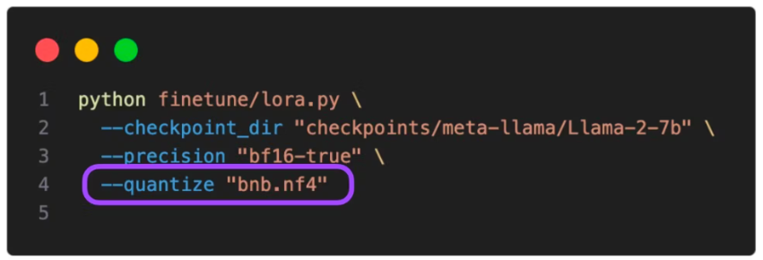
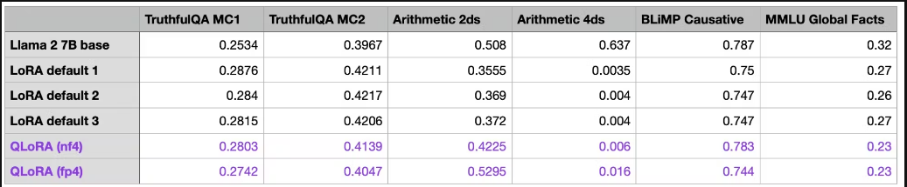

# LLaMA 7B Chat 모델 파인튜닝-Step by Step

---

## 목표

- QLoRA 기법을 활용하여 나만의 데이터셋을 파인튜닝하여 허깅페이스에 배포해보기

### 경제적인 파인튜닝을 위한 PEFT와 QLoRA 기법

- 파인튜닝을 진행할 때 모델 전체의 파라미터를 수정하지 않고 일부 파라미터만 업데이트를 하더라도 전체 파라미터를 수정했을 때에 준하는 수준의 성능을 기대할 수 있을 정도로 간소화된 기법이 대중화 되고 있다.
- **PEFT(Parameter Efficient Fine-tuning)**는 모델 전체의 파라미터를 튜닝할 필요가 없이, 일부 파라미터를 튜닝하더라도 모델의 성능을 적은 자원으로 튜닝할 수 있도록 하는 방법을 의미한다.
- **PEFT**에는 **LoRA(Low Rank Adapation)** 기법이 주로 사용되고 있고, 최근에는 **QLoRA** 기법이 제시되고 있다.

### LoRA

- LoRA는 고정 가중치를 가지고 있는 **Pretrained 된 모델**을 기반으로 추가 학습이 가능한 Rank Decomposition 행렬을 트랜스포머 아키텍처의 각 레이어에 붙인 것이다. 즉, 훈련 가능한 레이어를 추가해서 별도의 훈련을 통해 학습시킨 것이다.

  

- LoRA는 Low Data Regime처럼 데이터가 적은 상황에서도 파인튜닝하기 용이하다는 장점이 있다.

- 우리가 LoRA를 통해 학습한 가중치는 작은 양이지만 사전 학습된 LLM 모델 레이어의 맨 윗 부분을 차지하게 되며, 다른 파라미터에 얼마나 영향을 줄 지 hyper parameter를 적절히 설정함으로서 모델의 성능을 결정할 수 있다.

- 최근에는 QLoRA라는 4비트 양자화 기법이 주목을 받으며 LLM 모델의 적은 비트의 포맷으로 설정하여 큰 메모리의 GPU 없이도 파인튜닝이 가능하게 되었다.

- 거대 언어모델의 파라미터 사이즈가 커져가는 와중에서도 적절한 양자화와 distillation을 통해 모델에 저장되고 메모리에 로드되는 부담을 줄인다.

- QLoRA는 LoRA의 가중치를 **NormalFloat** 이라는 **FP4를 변형한 자료형**을 사용하여 **4비트 양자화**를 한다.

- 해당 자료형은 비선형적인 간격과 비대칭 분포를 바탕으로 -1부터 1까지의 범위를 나타내서 저장한다.

-  양자화를 통해 사이즈를 줄이면서도 트레이닝이나 역전파 과정에서는 역양자화 과정을 수행하여 **저수준의 비트를 32비트로 근사하여 일정한 성능을 유지**할 수 있다.

  

- 위 테이블을 보면 QLoRA 기법을 활용하였을 때 일반적인 LoRA 파인튜닝 기법보다 모델에 미치는 영향이 적은 것을 확인, 양자화가 인메모리 로드 부담을 절감시키는데 상당한 효과가 있음을 고려한다면 가성비 대비 효과적이라고 할 수 있다.

### Step 1. 라이브러리 Import

```py
import os  # os 모듈 운영체제와 상호 작용할 수 있는 기능을 제공
import torch # PyTorch 라이브러리로, 주로 딥러닝과 머신러닝 모델을 구축, 학습, 테스트하는 데 사용
from datasets import load_dataset  # 데이터셋을 쉽게 불러오고 처리할 수 있는 기능을 제공
from transformers import (
    AutoModelForCausalLM, # 인과적 언어 추론(예: GPT)을 위한 모델을 자동으로 불러오는 클래스
    AutoTokenizer, # 입력 문장을 토큰 단위로 자동으로 잘라주는 역할 
    BitsAndBytesConfig, # 모델 구성
    HfArgumentParser,  # 파라미터 파싱
    TrainingArguments,  # 훈련 설정
    pipeline,  # 파이프라인 설정
    logging,  #로깅을 위한 클래스
)

# 모델 튜닝을 위한 라이브러리
from peft import LoraConfig, PeftModel  
from trl import SFTTrainer
```

- 라이브러리 `BitAndBytes`가 앞서 살펴보았던 벡터의 INT8 최대 절대값 양자화 기법을 사용할 수 있도록 도와주는 MetaAI의 라이브러리

### Step 2. Llama 2 모델과 데이터 가져오기 🤗

```py
# Hugging Face 허브에서 훈련하고자 하는 모델을 가져와서 이름 지정
model_name = "NousResearch/Llama-2-7b-chat-hf"  

# instruction 데이터 세트 설정
dataset_name = "mlabonne/guanaco-llama2-1k"

# fine-tuning(미세 조정)을 거친 후의 모델에 부여될 새로운 이름을 지정하는 변수
new_model = "llama-2-7b-yubong" 
```

- Pretrained된 베이스 모델 Llama 2의 7B Chat 모델 선택

- [1000개 dataset](https://huggingface.co/datasets/mlabonne/guanaco-llama2-1k) 

### Step 3.  LoRA (Low-Rank Adaptaition) 파라미터 설정

```py
# LoRA에서 사용하는 low-rank matrices 어텐션 차원을 정의. 여기서는 64로 설정
# 값이 크면 클수록 더 많은 수정이 이루어지며, 모델이 더 복잡해질 수 있음
lora_r = 64   

# LoRA 적용 시 가중치에 곱해지는 스케일링 요소. 여기서는 16으로 설정
# LoRA가 적용될 때 원래 모델의 가중치에 얼마나 영향을 미칠지 결정. 높은 값은 가중치 조정의 강도를 증가시킴
lora_alpha = 16  

# Dropout probability for LoRA layers   # LoRA 층에 적용되는 드롭아웃 확률. 여기서는 0.1 (10%)로 설정
lora_dropout = 0.1 # 일부 네트워크 연결을 무작위로 비활성화하여 모델의 강건함에 기여
```

- 가중치를 조정하여 더 좋은 성능을 내어 추가적인 작업에 더 잘 맞도록 하는 기법으로 이는 모델의 전체 구조를 변경하지 않으면서도 효율적으로 모델을 조정할 수 있다는 장점이 있음
- `lora_r`은 정보의 손실과 효율성 사이에 균형을 맞추기 위해 여러 시도를 통해 결정할 수 있는 파라미터로 모델의 가중치 행렬을 두 개의 low-rank 행렬의 곱으로 근사하기 때문에, `lora_r`의 값이 커질 수록 더 많은 정보를 유지하면서 모델이 훈련 데이터에 과도하게 적응하게 하여 오비피팅의 가능성을 높힌다.
- 한편으로 `lora_r`의 값이 낮을 수록 정보가 손실되며 모델이 데이터의 복잡한 특성을 포착할 가능성을 낮춘다.
- `lora_alpha`는 LoRA 기법을 적용할 때 가중치에 곱해지는 scaling factor로서 원래의 모델에 대비하여 LoRA 가중치에 얼마나 영향을 미칠지를 결정한다.
- `lora_dropout` 파라미터는 전통적인 머신러닝에서 과적합을 방지하기 위하여 훈련 과정에서 네트워크의 일부 가중치를 0으로 설정하는 방법을 적용하기 위하여 쓰인다. 가중치 행렬을 조정할 때 low-rank matrices로 가중치 행렬을 근사하는데 이 때 LoRA 변화량을 모델에 적용하기 전에 일부 원소를 임의로 0으로 만드는 방법이다.

### Step 4. `bitsandbytes` 파라미터 설정

```py
# 4-bit precision 기반의 모델 로드
use_4bit = True 

# 4비트 기반 모델에 대한 dtype 계산
bnb_4bit_compute_dtype = "float16" 

# 양자화 유형(fp4 또는 nf4)
bnb_4bit_quant_type = "nf4" 

# 4비트 기 모델에 대해 중첩 양자화 활성화(이중 양자화)
use_nested_quant = False 
```

- `bitsandbytes`는 QLoRA 기법을 적용하기 위하여 사용되는 8비트 양자화 라이브러리
- 라이브러리를 통해 양자화 관련 설정값을 지정할 수 있음
- 예를 들어 
  - 4비트 베이스 모델을 로딩
  -  4비트 모델의 연산 과정에서 사용할 데이터 타입을 지정
  - 양자화의 유형을 명시등의 세부적인 설정을 진행할 수 있음

### Step 5. `TrainingArguments` 파라미터 설정

```python
#모델이 예측한 결과와 체크포인트가 저장될 출력 디렉터리
output_dir = "./results" 

# 훈련 에포크 수
num_train_epochs = 1 

# fp16/bf16 학습 활성화(A100으로 bf16을 True로 설정)
fp16 = False   
bf16 = False   

# 훈련용 배치 크기
per_device_train_batch_size = 1 

# 평가용 배치 크기
per_device_eval_batch_size = 1  

# 그래디언트를 누적할 업데이트 스텝 횟수
gradient_accumulation_steps = 1  

# 그래디언트 체크포인트 활성화
gradient_checkpointing = True  


# 그래디언트 클리핑을 위한 최대 그래디언트 노름을 설정. 
# 그래디언트 클리핑은 그래디언트의 크기를 제한하여 훈련 중 안정성을 높임.
# Maximum gradient normal (그래디언트 클리핑) 0.3으로 설정
max_grad_norm = 0.3  

# 초기 학습률 AdamW 옵티마이저
learning_rate = 2e-6 

# bias/LayerNorm 가중치를 제외하고 모든 레이어에 적용할 Weight decay 값
weight_decay = 0.001 

# 옵티마이저 설정
optim = "paged_adamw_32bit"  

# 학습률 스케줄러의 유형 설정, 여기서는 코사인 스케줄러 사용
lr_scheduler_type = "cosine"   

# 훈련 스텝 수(num_train_epochs 재정의)
max_steps = -1 

# (0부터 learning rate까지) 학습 초기에 학습률을 점진적으로 증가시키 linear warmup 스텝의 Ratio
warmup_ratio = 0.03  

# 시퀀스를 동일한 길이의 배치로 그룹화, 메모리 절약 및 훈련 속도를 높임
group_by_length = True   

# X 업데이트 단계마다 체크포인트 저장
save_steps = 0  

# 매 X 업데이트 스텝 로그
logging_steps = 25  
```

- Trainer는 허깅페이스에서 제공하는 라이브러리로 모델의 학습부터 평가까지 한 번에 해결할 수 있는 API를 제공
- `num_train_epchs` 파라미터를 통해 모델이 전체 데이터셋을 몇 번 반복하여 학습할 지를 지정
- `per_device_train_batch_size` 각 GPU에서 한 번에 처리할 데이터의 양
  - 여기서는 모두 1로 지정하여 한 번에 하나의 데이터만 처리하도록 설정
- `gradient_accumulation_steps` 파라미터를 통해 기울기를 갱신하기 전에 몇 번의 기울기 업데이트를 축적할지를 결정
  - 여기서는 1로 설정되어 있어 매 스텝마다 기울기를 갱신
- `gradient_checkpointing` 파라미터를 통해 메모리 사용을 최적화
  - 대규모 모델을 사용할 때 특히 유용한 파라미터로서 필요할 때만 특정 계층의 기울기를 저장하고 나머지는 버려 메모리의 부담을 줄임
- `max_grad_norm` 파라미터를 통해 모델이 데이터로부터 학습하는 속도를 조절, 기울기가 과도하게 커져서 발생할 수 있는 **gradient exploding** 문제 등을 방지할 수 있도록 기울기의 최대 크기를 설정
- **Adam** 옵티마이저를 사용하여 `learning_rate`를 보수적으로 잡아 모델이 데이터로부터 학습하는 속도를 적절히 늦추도록 설정
- weight_decay 값을 적절히 주어 모델의 가중치가 너무 큰 값을 가지지 않도록 함으로서 오버피팅 현상을 해소
  - 스케줄러는 **Cosine Decay**를 사용하여 안정적으로 끊김없이 Loss가 감소하도록 할 것이다.

### Step 6. SFT 파라미터 값 설정

```py
# 최대 시퀀스 길이 설정
max_seq_length = None 

# 동일한 입력 시퀀스에 여러 개의 짧은 예제를 넣어 효율성을 높일 수 있음
packing = False  

# GPU 0 전체 모델 로드 
device_map = {"": 0}  
```

- SFT는 라벨러들이 제작한 프롬프트 데이터셋을 이용하여 베이스 모델을 지도학습 바탕으로 파인 튜닝하는 기법으로, 주어진 일정 토큰에 대한 다음 토큰을 예측하는 형식으로 진행된다.
- `max_seq_length`는 입력 시퀀스에 대한 최대 사이즈를 의미
  - 예를 들어 문장 2개가 합쳐질 때 maximum sequence가 어느 정도일지를 결정
- `packing` 이란 훈련과정에서의 효율성을 높이기 위해 복수 개의 예시 문장을 하나의 Input 시퀀스로 넣어주는 기법
- `device_map`을 통해 몇 번 GPU를 로드할 지 지정

### Step 7. 데이터 세트 로딩과 데이터 타입 결정

```py
dataset = load_dataset(dataset_name, split="train")
```

```py

compute_dtype = getattr(torch, bnb_4bit_compute_dtype)
# 모델 계산에 사용될 데이터 타입 결정
bnb_config = BitsAndBytesConfig(
    load_in_4bit=use_4bit,  # 모델을 4비트로 로드할지 여부를 결정
    bnb_4bit_quant_type=bnb_4bit_quant_type, # 양자화 유형을 설정
    bnb_4bit_compute_dtype=compute_dtype,  # 계산에 사용될 데이터 타입을 설정
    bnb_4bit_use_double_quant=use_nested_quant, # 중첩 양자화를 사용할지 여부를 결정
)
```

- SFT를 진행하기 위한 데이터셋을 로드 BitsAndBytesConfig 인스턴스를 생성할 때 앞서 살펴보았던 데이터 입을 주입

### Step 8. GPU 호환성 확인

```py

# 만약 GPU가 최소한 버전 8 이상이라면 (major >= 8) bfloat16을 지원한다고 메시지를 출력. 
# bfloat16은 훈련 속도를 높일 수 있는 데이터 타입. 

if compute_dtype == torch.float16 and use_4bit:
    major, _ = torch.cuda.get_device_capability()
    if major >= 8:
        print("=" * 80)
        print("Your GPU supports bfloat16: accelerate training with bf16=True")
        print("=" * 80)
```

- 현재 GPU가 bfloat16 형태를 지원하는 지 확인한다. 만약 GPU의 CUDA 버전이 8 이상이라면 해당 데이터 타입을 지원하는 것이다.
- bfloat16이란 모델의 트레이닝 속도를 높일 수 있는 데이터 타입으로서, 16비트 부동 소수점 형식을 나타낸다.
-  물론 **32비트 부동 소수점 형식보다는 정확도가 비교적 떨어지지만** 메모리 요구 사항이 적다는 점에서 모델 학습에 유용하다고 할 수 있다.

### Step 9. 베이스 모델 로딩

- 베이스 모델과 토크나이저를 로드한 다음 LoRA 연산을 적용

```py
# Load base model
model = AutoModelForCausalLM.from_pretrained(
    model_name,
    quantization_config=bnb_config,
    device_map=device_map
)
model.config.use_cache = False
model.config.pretraining_tp = 1

# Load LLaMA tokenizer
tokenizer = AutoTokenizer.from_pretrained(model_name, trust_remote_code=True)

# 동일한 batch 내에서 입력의 크기를 동일하기 위해서 사용하는 Padding Token을 End of Sequence라고 하는 Special Token으로 사용한다.
tokenizer.pad_token = tokenizer.eos_token
tokenizer.padding_side = "right" # Fix weird overflow issue with fp16 training. Padding을 오른쪽 위치에 추가한다.

# Load LoRA configuration
peft_config = LoraConfig(
    lora_alpha=lora_alpha,
    lora_dropout=lora_dropout,
    r=lora_r,
    bias="none",
    task_type="CAUSAL_LM", # 파인튜닝할 태스크를 Optional로 지정할 수 있는데, 여기서는 CASUAL_LM을 지정하였다.
)

# Set training parameters
training_arguments = TrainingArguments(
    output_dir=output_dir,
    num_train_epochs=num_train_epochs,
    per_device_train_batch_size=per_device_train_batch_size,
    gradient_accumulation_steps=gradient_accumulation_steps,
    optim=optim,
    save_steps=save_steps,
    logging_steps=logging_steps,
    learning_rate=learning_rate,
    weight_decay=weight_decay,
    fp16=fp16,
    bf16=bf16,
    max_grad_norm=max_grad_norm,
    max_steps=max_steps,
    warmup_ratio=warmup_ratio,
    group_by_length=group_by_length,
    lr_scheduler_type=lr_scheduler_type,
    report_to="tensorboard"
)

# Set supervised fine-tuning parameters
trainer = SFTTrainer(
    model=model,
    train_dataset=dataset,
    peft_config=peft_config,
    dataset_text_field="text",
    max_seq_length=max_seq_length,
    tokenizer=tokenizer,
    args=training_arguments,
    packing=packing,
)
```

### Step 10. 모델 훈련과 훈련된 모델 저장

- 모델을 저장하면 base_model 파라미터를 제외한 Adapter 부분만 저장 된 것을 확인할 수 있다.

  

- `trainer` 객체는 이전에 정의된 여러 설정(모델, 데이터 세트, 훈련 파라미터 등)을 포함한다.

- `train` 메서드를 통해 데이터세트를 반복적으로 처리하면서 모델의 가중치를 업데이트하는 모습을 볼 수 있다.

```py
trainer.train()

# 훈련이 완료된 모델을 'new_model'에 저장 
trainer.model.save_pretrained(new_model) 
```

### Step 11. 모델 이름 출력, 기본 모델 재로딩 후 LoRA 가중치와의 통합

- 학습된 LoRA adapter 가중치를 원본 모델에 병합하는 `merge_and_unload` 메서드를 활용해 **모델과 LoRA를 따로 불러와 매핑하지 않고 하나의 모델로 활용**
- LoRA 어댑터를 통해 얻은 파인튜닝의 결과물 크기는 몇 MB밖에 되지 않는다.
- 이러한 어댑터를 사전 훈련된 모델에 `merge_and_unload` 한 줄로 병합하고 해당 모델을 배포한다.
- 이러한 어댑터 패턴의 장점은 특정한 태스크에 따라 파인튜닝 된 어댑터를 유연하게 설정할 수 있다.

```py
# base_model과 new_model에 저장된 LoRA 가중치를 통합하여 새로운 모델을 생성
base_model = AutoModelForCausalLM.from_pretrained(
    model_name,
    low_cpu_mem_usage=True,
    return_dict=True,
    torch_dtype=torch.float16
)
model = PeftModel.from_pretrained(base_model, new_model) # LoRA 가중치를 가져와 기본 모델에 통합
```

```py
model = model.merge_and_unload()
```

```py
# 사전 훈련된 토크나이저를 다시 로드
tokenizer = AutoTokenizer.from_pretrained(model_name, trust_remote_code=True)  

# 토크나이저의 패딩 토큰을 종료 토큰(end-of-sentence token)과 동일하게 설정
tokenizer.pad_token = tokenizer.eos_token  

# 패딩을 시퀀스의 오른쪽에 적용
tokenizer.padding_side = "right"  
```

### Step 12. Hugging Face Hub 로그인 업로드

```py
from huggingface_hub import interpreter_login

interpreter_login()
```

```python
model.push_to_hub(new_model, use_temp_dir=False)
tokenizer.push_to_hub(new_model, use_temp_dir=False)
```

