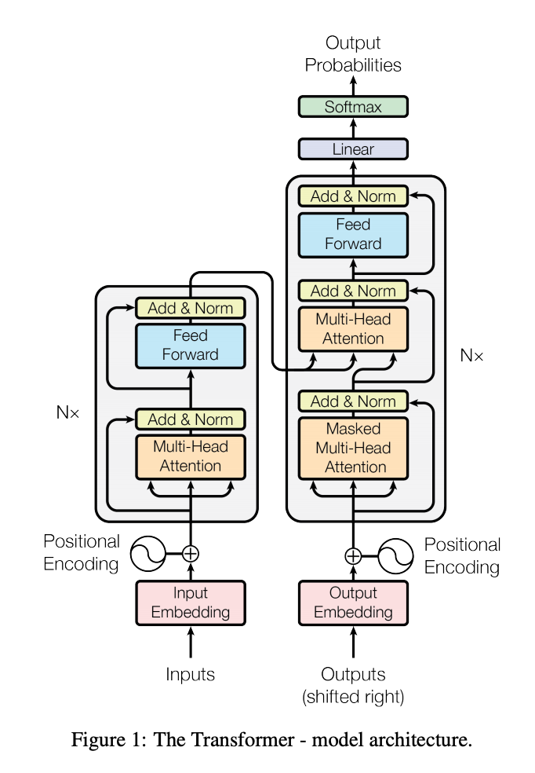
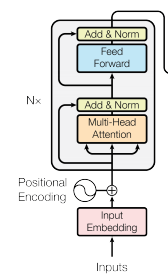
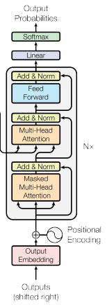
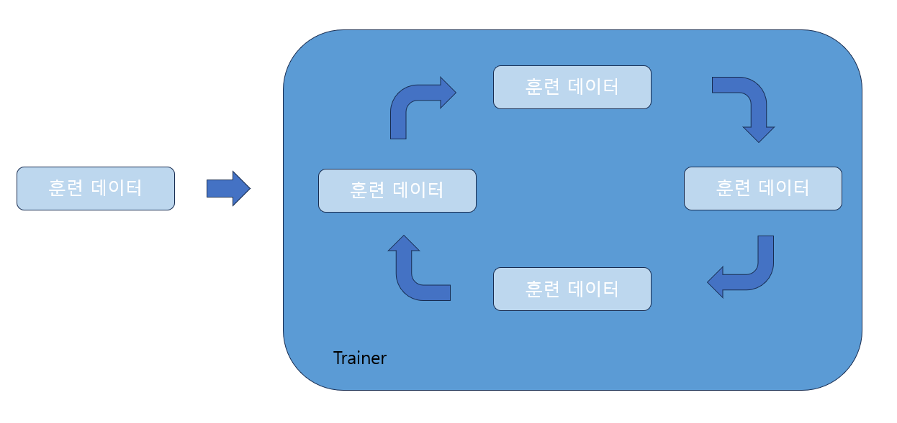
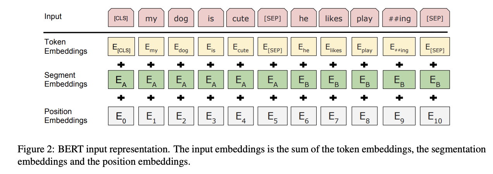

# 쉽고 빠르게 익히는 실전 LLM

## 목차

- Chapter 1

### 참조

- [LLM 기본 개념 알아보기](https://data-newbie.tistory.com/953)

## Chapter 1 - LLM

## 1.1 LLM 이란?

- LLM(Large Language Model)은 대부분 트랜스포머 아키텍처에서 파생된 AI 모델로, 사람의 언어, 코드 등을 이해하고 생성하기 위해 설계 되었습니다.

**1.1.1 LLM 정의**

- **언어 모델링**은 NLP의 하위 분야로, 지정된 어휘 내의 토큰 시퀀스 가능성을 예측하기 위한 통계/딥러닝 모델의 생성을 포함합니다.

- 두 종류 의 언어 모델링 작업

  

- **자기회귀 언어 모델**Autoregressive Language Model은 문장에서 이전 토큰만을 기반으로 다음 토큰을 예측하도록 훈련됩니다. 이러한 모델은 트랜스포머 모델의 디코더 부분에 해당하며, 어텐션 헤드attention head가 앞서 온 토큰만 볼 수 있도록 전체 문장에 마스크mask가 적용되어 있습니다. 자기회귀 모델은 텍스트 생성에 이상적입니다. 이러한 모델 유형의 좋은 예는 **GPT**입니다.
-  **자동 인코딩 언어 모델**Autoencoding Language Model은 손상된 버전의 입력 내용으로부터 기존 문장을 재구성하도록 훈련됩니다. 이러한 모델은 트랜스포머 모델의 인코더 부분에 해당하며 마스크 없이 전체 입력에 접근할 수 있습니다. 자동 인코딩 모델은 전체 문장의 양방향 표현을 생성합니다. 텍스트 생성과 같은 다양한 작업에 파인튜닝될 수 있지만 주요 애플리케이션은 문장 분류 또는 토큰 분류입니다. 이 모델 유형의 전형적인 예는 **BERT**입니다.

**1.1.2 LLM 주요 특징**

- 인코더(Encoder)

  - 원시 텍스트를 받아들여 핵심 구성 요소로 분리하고, 해당 구성 요소를 벡터로 변환하는 업무를 담당하며, 언텐션을 사용하여 텍스트의 맥락을 이해

- 디코더

  - 수정된 형식의 어텐션을 사용하여 다음에 올 최적의 토큰을 예측함으로서 텍스트를 생성하는데 뛰어남

- 일반적으로 LLM은 세 가지 주요 카테고리로 분류될 수 있음

  - GPT와 같은 **자기회귀 모델**은 이전 토큰을 기반으로 문장의 다음 토큰을 예측, 이러한 LLM은 주어진 맥락을 따라서 일관성 있는 텍스트를 생성하는 데 효과적

  - BERT와 같은 **자동 인코딩 모델**은 입력 토큰 중 일부를 가리고 남아있는 토큰으로부터 그것들을 예측하여 문맥을 양방향으로 이해하여 표현을 구축 - 이러한 LLM은 토큰 간의 맥락적 관계를 빠르고 대규모로 포착하는데 능숙하여 텍스트 분류 작업에 이용하기에 좋음

  - T5 와 같은 **자기회귀와 자동 인코딩의 조합**은 다양하고 유연한 텍스트를 생성하기 위해 인코더와 디코더를 함께 사용할 수 있음. 이러한 조합 모델은 인코더를 사용하여 추가 맥락을 포착하는 능력 때문에, 순수한 디코더 기반의 자기회귀 모델보다 여러 가지 문맥에서 더 다양하고 창의적인 텍스트를 생성할 수 있음

    

- 기존 시퀀스-투-시퀀스 트랜스포머

  - 자동 인코딩과 자기회귀 모델링 작업을 학습하고 실행할 수 있음. T5 계열

    

- 인코더만 있는 모델

  - BERT 계열

    

- 디코더만 있는 모델

  - GPT 계열

    

**1.1.3 LLM 작동 원리**

- 사전 훈련

  - 거의 모든 LLM은대량의 텍스트 데이터로 특정 언어 모델링 관련 작업에 대해 사전 훈련되었습니다.
  - 사전 훈련 중에 LLM은 일반적인 언어와 단어 간의 관계를 배우고 이해하려고 합니다.
  - BERT는 두 가지 특정한 언어 모델링 작업에서 사전 훈련되었습니다.
    - 마스크된 언어 모델링(MLM) 작업 : BERT가 하나의 문장 안에서 토큰의 상호작용을 인식하도록 도움 -> 개별 단어 임베딩을 가르치기 위함
    - 다음 문장 예측(NSP) 작업 : BERT가 문장들 사이에서 토큰이 서로 어떻게 상호작용하는지를 이해하도록 도움 -> 전체 텍스트 쉬컨스를 임베딩하는 방법을 학습하기 위함

- 전이 학습(Transfer Learning)

  - 머신러닝에서 한 작업에서 얻은 지식을 활용하여 다른 관련 작업의 성능을 향상시키는 기술

  - LLM에 대한 전이학습은 텍스트 데이터의 한 말뭉치에서 사전훈련된 LLM을 가져옴

  - 텍스트 분류나 텍스트 생성과 같은 작업을 위해 특정 데이터로 모델의 파라미터를 업데이트함으로서 모델을 파인튜닝하는 것을 포함함

  - **파인튜닝**

    - LLM을 작업에 특화된 상대적으로 작은 크기의 데이터셋에서 훈련시켜, 특정 작업을 위한 파라미터를 조정하는 것을 의미
    - 이를 통해 특정 작업의 정확도를 향상시킬 수 있음

    

    1. 파인튜닝하려는 모델과 파이뉴닝 파라미터(예: 학습률)을 결정
    2. 학습(훈련) 데이터를 모음
    3. 손실(오류의 판단 기준)과 기울기(오류를 최소화하기 위해 모델을 어떻게 변경할지에 대한 정보) 를 계산
    4. 오류를 최소화하기 위해 모델 파라미터를 업데이트하는 메커니즘인 역전파를 통해 모델을 업데이트

  - **어텐션**

    - 어텐션은 트랜스포머만이 아니라 다양한 가중치를 입력의 다른 부분에 할당하는 딥러닝 모델에서 사용되는 메커니즘
    - 본질적으로 모델이 동적으로 입력의 다른 부분에 '집중' 할 수 있게 하여, 성능 향상과 더 정확한 결과를 이끌어냄
    - 요약하면, LLM은 큰 말뭉치에서 사전 훈련되고 때로는 특정 작업을 위해 더 작은 데이터셋에서 파인튜닝 됩니다.

  - **임베딩**

    - 자연어 처리에서 임베딩은 다른 단어와의 의미와 관계를 포착하는 방식으로 단어, 구절, 또는 토큰을 나타냄

    - 위치 임베딩

      - 문장에서 토큰의 위치를 인코딩

    - 토큰 임베딩

      - 토큰의 의미를 인코딩

    - 주어진 텍스트에 대해 BERT가 어떻게 세 가지 층의 임베딩을 사용하는지의 예시

      

  - **토큰화**

    - 텍스트를 가장 작은 이해 단위인 토큰으로 분해하는 과정
    - 어텐션 계산에 입력으로 사용되어 LLM이 실제로 학습하고 작동하게 됨
    - 토큰화에는 **대소문자 변환**이라는 전처리 단계도 포함될 수 있습니다. 대소문자 변환에는 소문자 토큰화와 대소문자 구분의 두 가지 타입이 있습니다.

